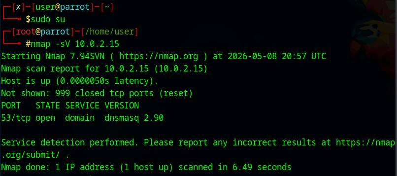

# Network Scanning Lab

## Objective
Perform reconnaissance and service enumeration using Nmap.

## Commands Used
```bash
sudo su
nmap -sV 10.0.2.15
```
## Key Learnings
- Identified open ports
- Learned service version detection
- Understood reconnaissance basics


## Screenshot


