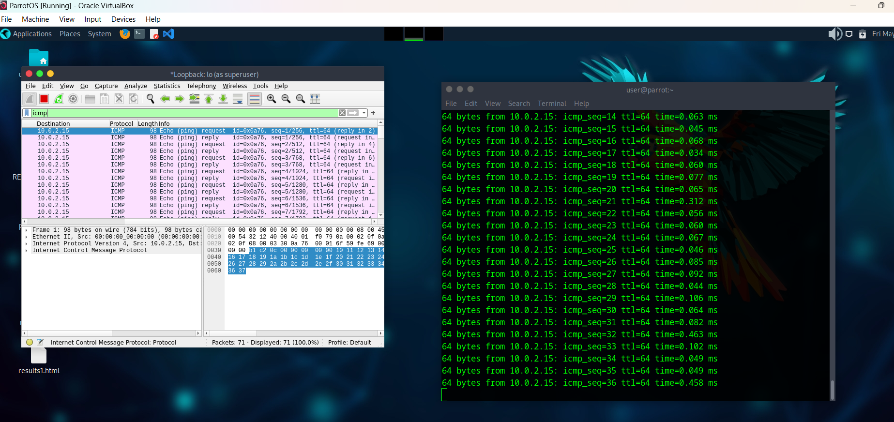

  # ICMP Packet Analysis Using Wireshark

## Objective
Capture and analyze ICMP ping traffic using Wireshark.

## Tools Used
- ParrotOS
- Wireshark
- Ping command

## Steps Performed

### Start Packet Capture
Selected the active loopback interface in Wireshark.

### Applied Filter

icmp

### Generated Traffic

ping 10.0.2.15

## Observations
- Observed ICMP Echo Request packets
- Observed ICMP Echo Reply packets
- Verified successful network communication

## Key Learnings
- Learned basic packet capture
- Understood ICMP protocol
- Learned Wireshark filtering
- Understood request/reply communication

## Screenshot

