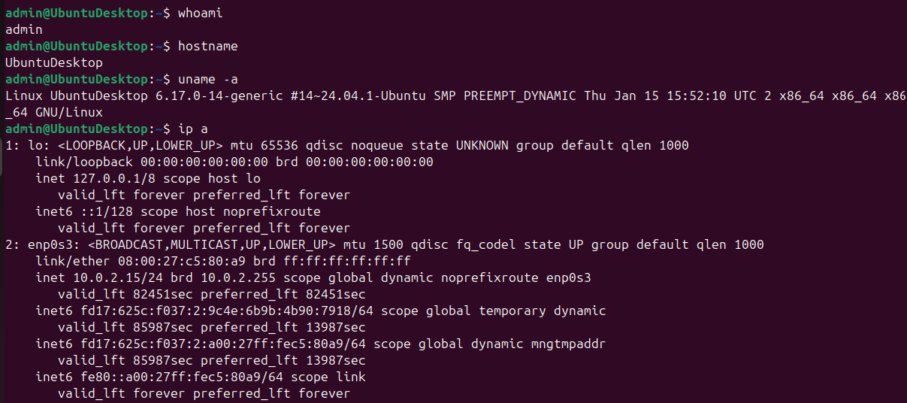
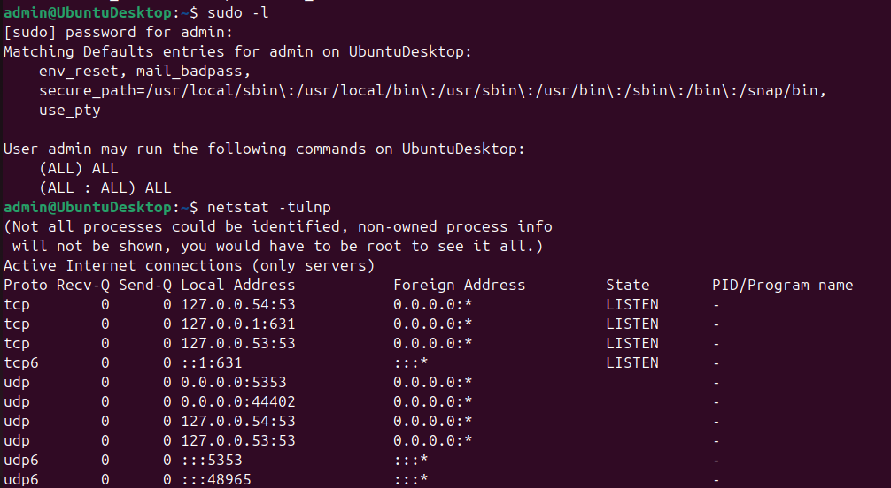
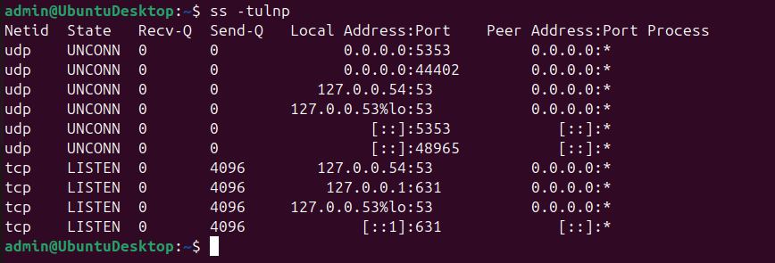

# Linux Enumeration Lab

## Objective
Perform basic Linux system enumeration.

## Commands Used

```bash
whoami
hostname
uname -a
ip a
sudo -l
ss -tulnp
```

## Purpose of Commands

| Command | Purpose |
|---|---|
| whoami | Shows current user |
| hostname | Displays system hostname |
| uname -a | Displays kernel and OS info |
| ip a | Shows network interfaces and IP addresses |
| sudo -l | Displays sudo privileges |
| ss -tulnp | Shows listening ports and services |

## Key Learnings
- Learned Linux enumeration basics
- Identified system/network information
- Viewed active services and privileges

## Screenshot




