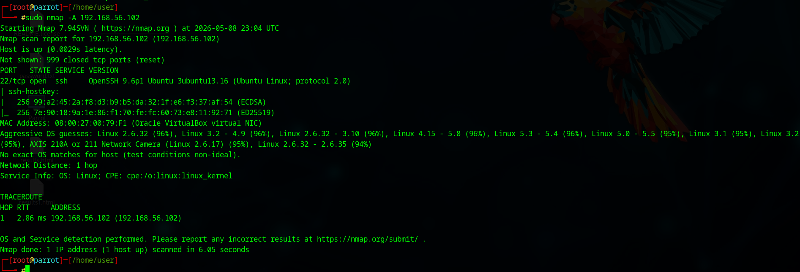

# Service Enumeration Using Nmap

## Objective
Perform aggressive scanning and service enumeration against an Ubuntu target machine.

## Tools Used
- ParrotOS
- Nmap
- Ubuntu
- OpenSSH Server

## Target Information

| Machine | IP Address |
|---|---|
| ParrotOS | 192.168.56.101 |
| Ubuntu | 192.168.56.102 |

## Commands Used

### Install SSH Server on Ubuntu

```bash
sudo apt update
sudo apt install openssh-server -y
sudo systemctl start ssh
```

### Verify SSH Status

```bash
sudo systemctl status ssh
```

### Aggressive Nmap Scan

```bash
sudo nmap -A 192.168.56.102
```

## Observations
- Detected open SSH service
- Identified TCP port 22
- Performed OS and service detection
- Observed traceroute and latency information

## Key Learnings
- Learned service enumeration
- Understood attack surface identification
- Learned aggressive scanning techniques
- Understood importance of exposed services

## Screenshot


