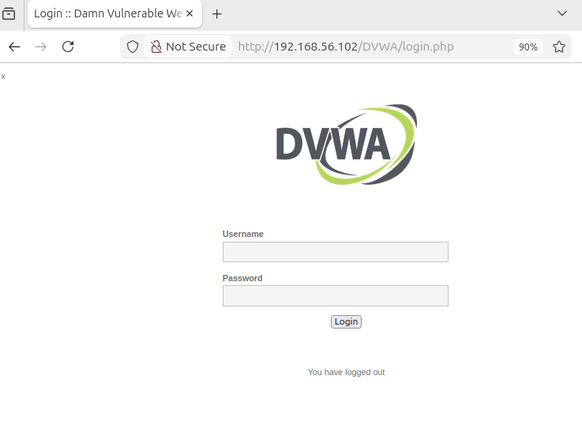
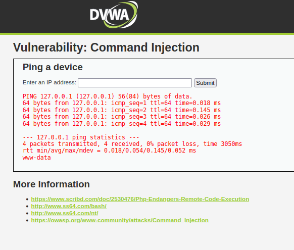

# DVWA (Damn Vulnerable Web Application) Setup Lab

## Objective
Set up a vulnerable web application environment for practicing web application security testing and ethical hacking concepts.

---

# Lab Environment

| Machine | Role | IP Address |
|---|---|---|
| ParrotOS | Attacker Machine | 192.168.56.x |
| Ubuntu Desktop | Target Machine | 192.168.56.102 |

---

# Network Configuration

The lab environment was configured using:

- NAT Adapter (Internet Access)
- Host-Only Adapter (Internal Lab Communication)

This allowed:
- Internet connectivity for package installation
- Isolated communication between virtual machines

---

# Tools and Technologies Used

- Oracle VirtualBox
- Ubuntu Desktop
- ParrotOS
- Apache2
- MariaDB
- PHP
- DVWA
- Nmap
- Wireshark

---

# Step 1 — Configure VirtualBox Networking

Both VMs were configured with:

## Adapter 1
- NAT

## Adapter 2
- Host-Only Adapter

This enabled:
- Internet access
- Internal penetration testing communication

---

# Step 2 — Verify Connectivity

## Check IP Address

```bash
ip a
```

## Test Connectivity

```bash
ping 192.168.56.102
```

---

# Step 3 — Install Apache, MariaDB, PHP

```bash
sudo apt update
sudo apt install apache2 mariadb-server php php-mysqli php-gd libapache2-mod-php git unzip -y
```

---

# Step 4 — Start Services

```bash
sudo systemctl start apache2
sudo systemctl start mariadb

sudo systemctl enable apache2
sudo systemctl enable mariadb
```

---

# Step 5 — Download DVWA

```bash
cd /tmp

wget https://github.com/digininja/DVWA/archive/refs/heads/master.zip

unzip master.zip

sudo mv DVWA-master /var/www/html/DVWA
```

---

# Step 6 — Configure Permissions

```bash
sudo chmod -R 777 /var/www/html/DVWA
sudo chown -R www-data:www-data /var/www/html/DVWA
```

---

# Step 7 — Create DVWA Config File

```bash
cd /var/www/html/DVWA/config

sudo cp config.inc.php.dist config.inc.php
```

---

# Step 8 — Configure MariaDB Database

```bash
sudo mysql
```

## Database Configuration

```sql
DROP USER IF EXISTS 'dvwa'@'localhost';
DROP DATABASE IF EXISTS dvwa;

CREATE DATABASE dvwa;

CREATE USER 'dvwa'@'localhost' IDENTIFIED BY 'password';

GRANT ALL PRIVILEGES ON dvwa.* TO 'dvwa'@'localhost';

FLUSH PRIVILEGES;

EXIT;
```

---

# Step 9 — Modify DVWA Config

```bash
sudo nano /var/www/html/DVWA/config/config.inc.php
```

## Update Database Credentials

```php
$_DVWA[ 'db_user' ] = 'dvwa';
$_DVWA[ 'db_password' ] = 'password';
```

---

# Step 10 — Restart Services

```bash
sudo systemctl restart apache2
sudo systemctl restart mariadb
```

---

# Step 11 — Access DVWA

## Local Access

```text
http://localhost/DVWA
```

## Remote Access From ParrotOS

```text
http://192.168.56.102/DVWA
```

---

# Step 12 — Create Database

After opening DVWA:
- Click "Create / Reset Database"
- Database creation completed successfully
- Redirected back to login page

---

# Step 13 — Login to DVWA

| Username | Password |
|---|---|
| admin | password |

---

# Step 14 — Configure Security Level

Navigate to:
- DVWA Security

Set:
- Security Level = Low

This enables easier vulnerability testing for learning purposes.

---

# Step 15 — Command Injection Test

Navigate to:
- Command Injection

## Normal Input

```text
127.0.0.1
```

## Command Injection Payload

```text
127.0.0.1 && whoami
```

---

# Vulnerabilities Practiced

- Command Injection
- Service Enumeration
- Network Scanning
- Web Application Deployment
- Apache Troubleshooting
- Database Configuration
- Linux Permissions Troubleshooting

---

# Troubleshooting Performed

## Issues Faced
- VirtualBox networking issues
- Host-only adapter configuration
- Apache service troubleshooting
- MariaDB authentication failure
- PHP module issues
- DVWA configuration errors
- GitHub authentication issue while cloning
- Clipboard sharing issues between host and VM

## Troubleshooting Techniques Used
- Log analysis
- Service status verification
- Permission fixing
- Database credential verification
- Apache error log analysis
- VM network troubleshooting

---

# Key Learnings

- Learned how to build a vulnerable web application lab
- Understood Apache and MariaDB configuration
- Learned Linux troubleshooting techniques
- Understood service enumeration using Nmap
- Learned basic web application attack concepts
- Learned VM networking and segmentation
- Learned cybersecurity lab setup methodology

---

# Screenshots

Add screenshots for:
- VM network configuration
- Nmap scanning
- Wireshark ICMP capture
- Apache running
- DVWA login page
- Command injection results

Example:

```markdown




```

---

# Conclusion

Successfully built and configured a personal cybersecurity web application testing lab using DVWA, Ubuntu, and ParrotOS for practicing ethical hacking and web vulnerability testing concepts.

